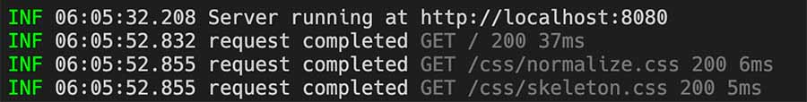

# pino-tiny

[](https://travis-ci.com/github/holmok/pino-tiny/builds/)


a tiny little log formatter for [pino](https://github.com/pinojs/pino).  

yeah, i know, [pino-colada](https://github.com/lrlna/pino-colada)...  

...but is does some weird black box stuff, and i did not like some of the formatting, and i was generally not too happy about certain things, so... 

i made pino-tiny! 

### sample output


### web log output with status and timings



## using it

pino-tiny is ran like any other pino output mangler, you run it as a process and pipe to it, and now it can also run as a prettifier, too! first you need to install it.  it's really not meant to be a production log formatter, so prolly install it in your project as a dev-dependency.

```bash
npm i -D pino-tiny
```

...run it with your application that is already using [pino](https://github.com/pinojs/pino) to log stuff...

```bash
$ node index.js | pino-tiny
```

...or put it in your `package.json` file...

```JSON
{
  ...
  "scripts": {
    "start": "nodemon index.js | pino-tiny",
    ...
  }
}
```

...or use it as a custom prettifier __(you will need to install `pino-pretty`)__, than initial you your logger in your code like so...

```JavaScript
// dependencies
const pino = require('pino')
const PinoTiny = require('pino-tiny')
const tiny = new PinoTiny()

// config and init logger
const logger = pino({
  prettyPrint:{},
  prettifier: tiny.prettier
})

// log something
logger.debug('debug message')
```

## what does pino-tiny do?

* shows log level, 3 characters, color coded, and ??? for custom log levels.
* timestamps (no dates).  you know what day it is but millisecond timestamps give you some performance output
* strips all but the msg for output (with some special cases below)
* if there is are `res` and  `req` properties in the log data, it will put dimmed request and response info (method, url, status code, response time).
* non-json string data that get piped in (like nodemon) get treated as info logs and outputted.
* does not swallow error messages.
* quits nicely

### new in 2.0

* removed extensibility (redundant to pino functionality)
* added compatibility with `pino-prettier` for in process logging
* source switched to TypeScript
* small format change in web logs

### new in v1.1

* timings added to web logs.
