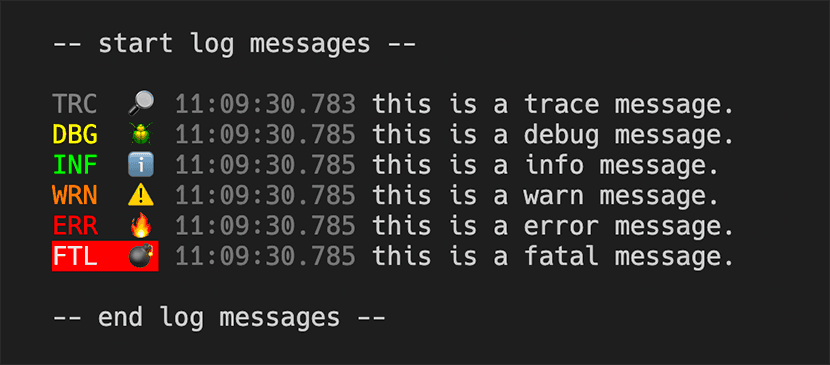

# pino-tiny

a tiny little log formatter for [pino](https://github.com/pinojs/pino).  

yeah, i know, [pino-colada](https://github.com/lrlna/pino-colada)...  

...but is does some weird black box stuff, and i did not like some of the formatting, and i was generally not too happy about certain things, so... 

i made pino-tiny! 



## using it

pino-tiny is ran like any other pino output mangler, you run it as a process and pipe to it. first you need to install it.  it's really not meant to be a production log formatter, so prolly install it in your project as a dev-dependency.

```bash
npm i -D pino-tiny
--or--
yarn add --dev pino-tiny
```

...run it with your application that is already using [pino](https://github.com/pinojs/pino) to log stuff...

```bash
$ node index.js | pino-tiny
```

### CLI Arguments

Now you can tweak the output a bit with command line arguments
```
Options:
      --help            Show help                                      
      --version         Show version number                            
  -i, --hide-icons      Hide level emoji icons.       
  -l, --hide-letters    Hide level letters.           
  -t, --hide-timestamp  Hide the timestamp.           
  -c, --hide-colors     Remove ansi colors from output.
  -w, --hide-web        Hide web stats.               
  -m, --msg-key         The key to use for message from the JSON log data.                                               
```

...or put it in your `package.json` file...

```JSON
{
  ...
  "scripts": {
    "dev": "nodemon index.js | pino-tiny",
    ...
  }
}
```

## use it in code!

pino-tiny can be used in code too as a prettifier, if you want.  here is how you set it up:

```javascript
const { PinoTinyPrettifier } = require('pino-pretty')
const Pino = require('pino')

const logger = new Pino({
  prettifier: PinoTinyPrettifier(/*{[options]}*/),
  prettyPrint: true
})

logger.trace('trace message')
logger.debug('debug message')
logger.info('info message')
logger.warn('warn message')
logger.error('error message')
logger.fatal('fatal message')
```

### Prettifier Options

The prettifier has the same options as the cli. Plus a filter function.

```typescript
PinoTinyOptions {
  hideIcons?: boolean
  hideLetters?: boolean
  hideTimestamp?: boolean
  hideColors?: boolean
  hideWeb?: boolean
  msgKey?: string
  filter?: (data: any) => any | undefined
}
```

The `filter` option allows you to filter and process the log data.  So you can do something like

```javascript
// remove ansi colors and remove messages that have secrets.
const logger = new Pino({
  prettifier: PinoTinyPrettifier(
    {
      hideColor: true,
      filter:(data) => {
        if (data.hasSecret) {
          return { ...data, msg:'*** secret ***' }
        } else {
          return data
        }
      }
    }
  ),
  prettyPrint: true
})
```

## extensible-ish

pino-tiny runs like a process you pipe the output of your application into and it makes nice output. it also exports a function `Run` that takes the filter option function as a parameter.

this allows you to control if a log entry gets printed, and you can mangle the output (in the msg property of the log). here is a ridiculous example:

```javascript
const { Run } = require('pino-tiny')

function filter (data) {
  if(data.msg.indexOf('happy') >= 0) { 
      // nothing happy gets out.
      return false; 
  } 
  else {
      // prepend msg with woah.
      return {
          ...data, 
          msg: `[woah!] ${data.msg}`
      } 
  } 
}
//start the logger
Run(filter)
```

## what does pino-tiny do?

* shows log level, 3 characters (and not a emoji icon), color coded, and ??? for custom log levels.
* timestamps (no dates).  you know what day it is but millisecond timestamps give you some performance output
* strips all but the msg for output
* if there is are `res` and  `req` properties in the log data, it will put dimmed request and response info (method, url, status code).
* non-json string data that get piped in (like nodemon) get treated as info logs and outputted.
* does not swallow error messages
* non-pino JSON will be logged as dimmed stringified JSON

### New in v2.0

* programmatic prettifier
* better colors
* handle non-pino json
* emojis! 🔎 🪲 ℹ️ ⚠️ 🔥 💣
* src is now in typescript

## New in v2.1

* added prettifier options
* added prettifier options as cli args
* added back the filter method in options
* added back the extensibility