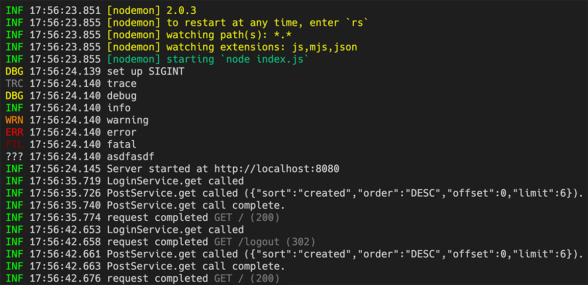

# pino-tiny

[](https://travis-ci.com/github/holmok/pino-tiny/builds/)


a tiny little log formatter for [pino](https://github.com/pinojs/pino).  

yeah, i know, [pino-colada](https://github.com/lrlna/pino-colada)...  

...but is does some weird black box stuff, and i did not like some of the formatting, and i was generally not too happy about certain things, so... 

i made pino-tiny! 



## using it

pino-tiny is ran like any other pino output mangler, you run it as a process and pipe to it. first you need to install it.  it's really not meant to be a production log formatter, so prolly install it in your project as a dev-dependency.

```bash
npm i -D pino-tiny
```

...run it with your application that is already using [pino](https://github.com/pinojs/pino) to log stuff...

```bash
$ node index.js | pino-tiny
```

...or put it in your `package.json` file...

```JSON
{
  ...
  "scripts": {
    "start": "nodemon index.js | pino-tiny",
    ...
  }
}
```

## what does pino-tiny do?

* shows log level, 3 characters, color coded, and ??? for custom log levels.
* timestamps (no dates).  you know what day it is but millisecond timestamps give you some performace output
* strips all but the msg for output (with some special cases below)
* if there is are `res` and  `req` properties in the log data, it will put dimmed request and response info (method, url, status code).
* non-json string data that get piped in (like nodemon) get treated as info logs and outputted.
* does not swallow error messages
* is extensible(ish)

## extensible(ish)?

pino-tiny runs like a process you pipe the output of your application into and it makes nice output. it also exports a module that returns a `start` method that takes a `filter` function as a parameter.

this allows you to controll if a log entry gets printed, and you can mangle the output (in the `msg` property of the log).  here is a ridiculous example:

```javascript
const { start } = require('pino-tiny')

function filter (data) {
  if(data.msg.indexOf('happy') >= 0) { 
      // nothing happy gets out.
      return false; 
  } 
  else {
      // prepend msg with woah.
      return {
          ...data, 
          msg: `[woah!] ${data.msg}`
      } 
  } 
}
//start the logger
start(filter)
```

more ideas in [examples](./examples)


